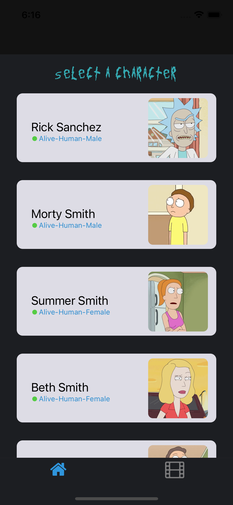
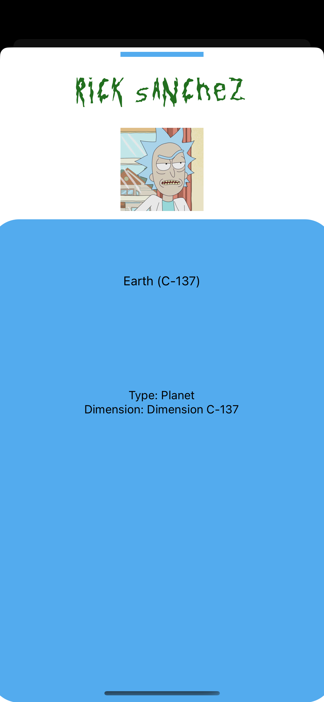
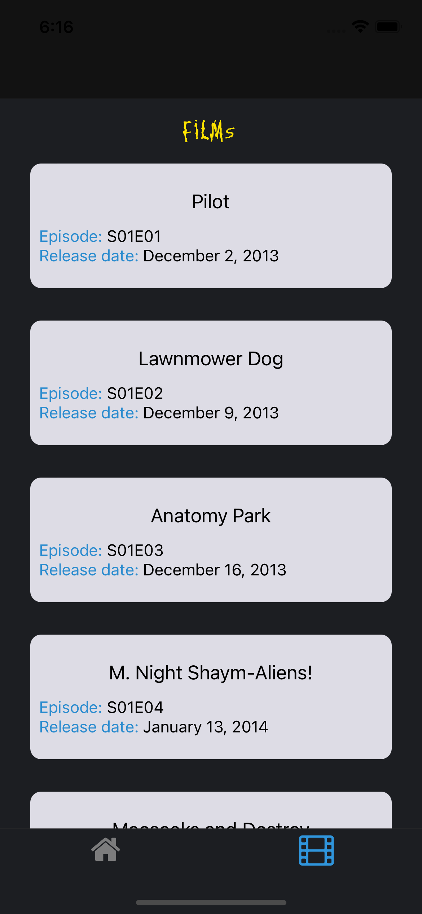

# Rick and Morty App

Este proyecto fue desarrollado con fines educativos, para la UNAHUR@TIC#1. Evento de actualizacion informatica.  

## Instalacion 

Utilice el administrado de paquetes yarn para instalar las dependencias del package.json 

```bash
yarn
```
Luego ejecute el script "yarn start"

```bash
yarn start
```

Seleccione el disposicivo en el cual desea ejecutar.

### Capturas de la app







